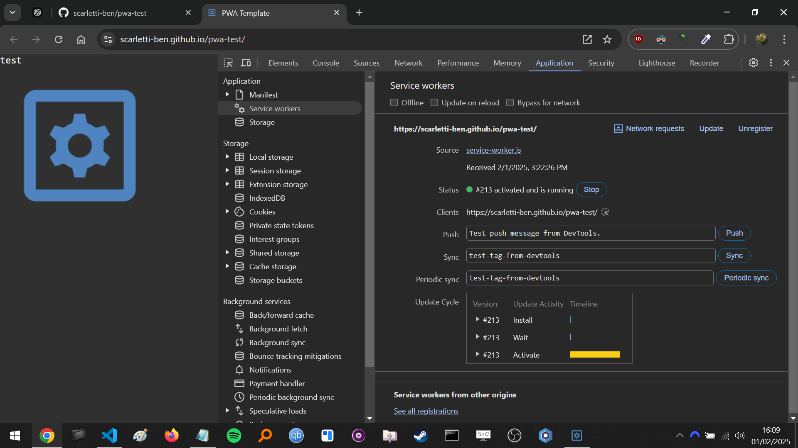
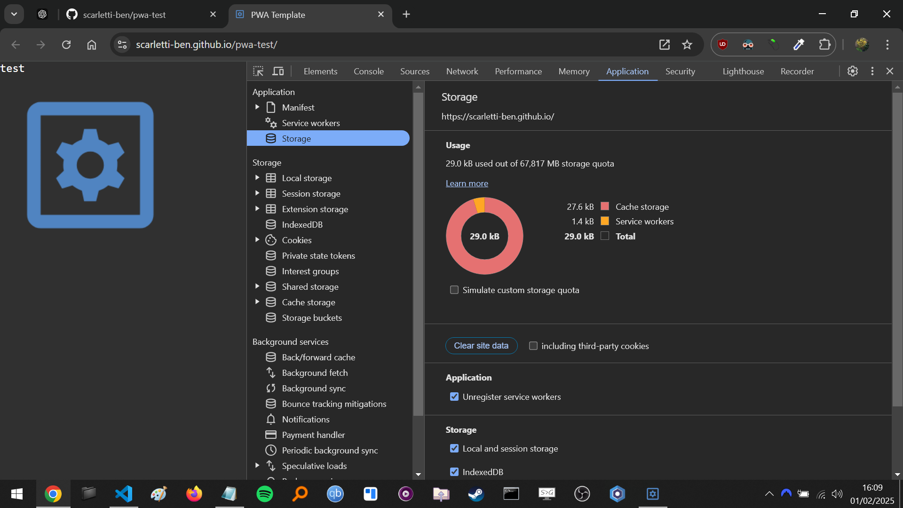
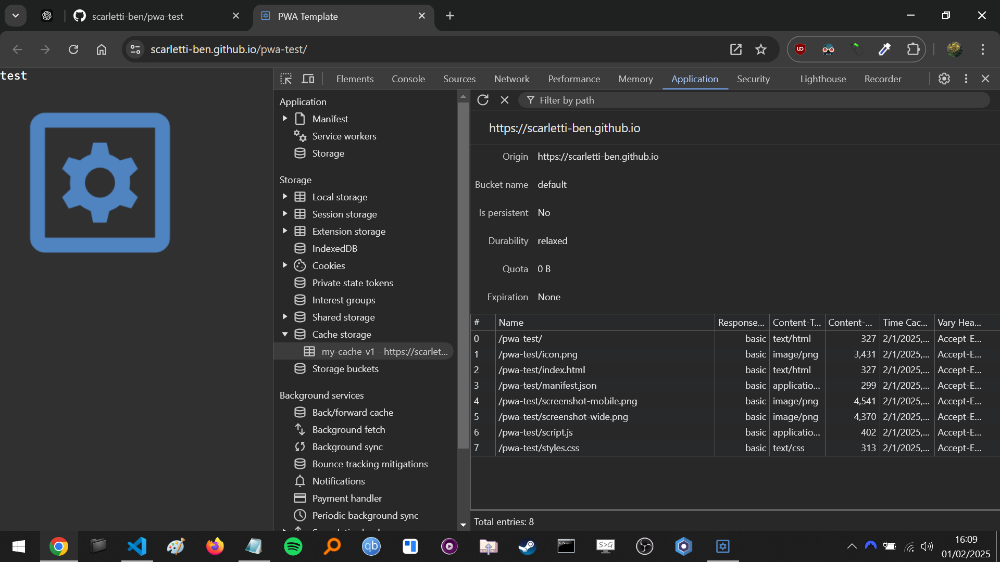
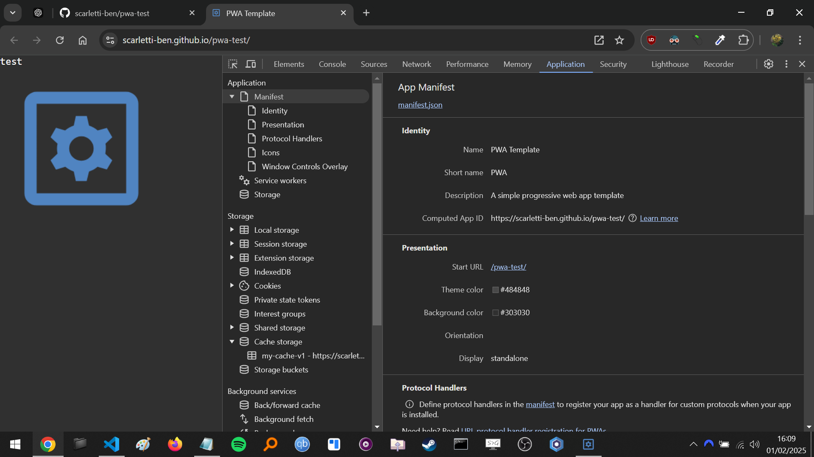
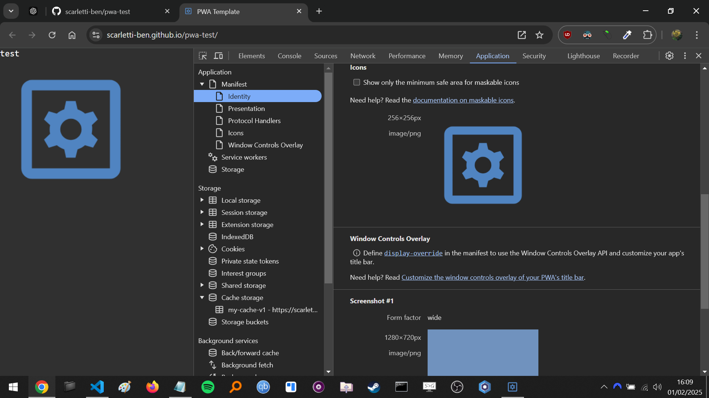

# General
- This will have issues when testing on localhost as it is setup for a `GitHub Pages` deployment
    - Could run server a directory back
- This PWA is online, and will attempt to connect to the site if it can
    - Service worker can take over

# TODO
- Fullscreen
- Immersive fullscreen
- `display-override` in manifest, mentioned in `Chrome DevTools`
- Explain versioning in manifest

# Links
https://www.youtube.com/watch?v=KzvK809rl3Q

# Issues
MANY attempts have been made to force the app to fill the space in the notch / cutout on Pixel, but none has worked
- Seems to work on firefox, but firefox opens two instances when you have an app version so that is another issue!

# Screenshots

# Learnings
- The capacity of `localstorage` is roughly `5MB` *per site*